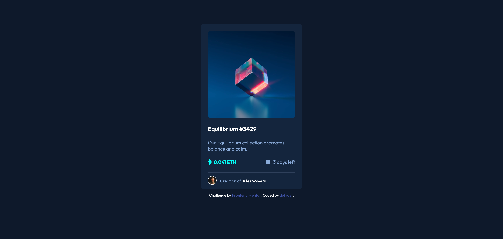

# Frontend Mentor - NFT preview card component solution

This is a solution to the [NFT preview card component challenge on Frontend Mentor](https://www.frontendmentor.io/challenges/nft-preview-card-component-SbdUL_w0U). Frontend Mentor challenges help you improve your coding skills by building realistic projects. 

## Table of contents

- [Overview](#overview)
  - [The challenge](#the-challenge)
  - [Screenshot](#screenshot)
  - [Links](#links)
- [My process](#my-process)
  - [Built with](#built-with)
  - [What I learned](#what-i-learned)
  - [Continued development](#continued-development)
  - [Useful resources](#useful-resources)
- [Author](#author)
- [Acknowledgments](#acknowledgments)

## Overview

### The challenge

Users should be able to:

- View the optimal layout depending on their device's screen size
- See hover states for interactive elements

### Screenshot



### Links

- Solution URL: [https://github.com/defydef/nft-preview-card]
- Live Site URL: [https://defydef.github.io/nft-preview-card/]

## My process

### Built with

- Semantic HTML5 markup
- CSS custom properties
- Flexbox

### What I learned

How to display an element when hovering on another element

```html
<div class="card">
    
    <span class="view-icon"></span>
..................
</div>
```
```css
.view-icon {
    position: absolute;
    left: calc(50% - 20px);
    top: calc(10vh + 125px);
    display: none;
}

/* Display .view-icon when hovering .card>img */
.card>img:hover + .view-icon {
    display: block;
}

```

### Continued development

Create more advanced and efficient CSS and HTML

### Useful resources
- https://stackoverflow.com/questions/18749276/css-on-hover-show-another-element

## Author

- Website - [defydef](https://github.com/defydef)
- Frontend Mentor - [@defydef](https://www.frontendmentor.io/profile/defydef)

## Acknowledgments

Thank you Frontend Mentor for providing the challenge!